# Hardmax MCTS Search Plan

This note turns the current hardmax/controller lane into an explicit search tree.

Related notes:

- [hardmax_structural_controller_lane_20260403.md](/home/zaytor/transformer_research/parameter-golf/research/project_wide/hardmax_structural_controller_lane_20260403.md)
- [execution_trace_hardmax_lane_20260403.md](/home/zaytor/transformer_research/parameter-golf/research/project_wide/execution_trace_hardmax_lane_20260403.md)
- [20260403_hardmax_research_questions_next_iter.md](/home/zaytor/transformer_research/parameter-golf/research/project_wide/20260403_hardmax_research_questions_next_iter.md)
- [20260403_hardmax_async_refinement_leg.md](/home/zaytor/transformer_research/parameter-golf/research/project_wide/20260403_hardmax_async_refinement_leg.md)

## Root Objective

Find the shortest path to a non-collapsed hard execution substrate that improves LM BPB, not just a prettier adapter.

Current empirical state:

- shallow structural supervision: collapse
- `structonly` adapter path: real
- routed hardmax path: premature
- execution-trace supervision: first branch that kept the `8`-state controller alive

So the root policy is:

- exploit the trace-supervision branch
- explore around transfer and conditioning architecture
- prune routing until the controller survives transfer into the LM

## Search Tree

```mermaid
flowchart TD
    R["Root: Non-collapsed hard execution substrate improves LM BPB"]

    R --> A["A: Trace-pretrained controller -> LM transfer"]
    R --> B["B: Trace representation search"]
    R --> C["C: Collapse-control search"]
    R --> D["D: Conditioning architecture search"]
    R --> E["E: Mechanistic validation"]
    R --> F["F: Routing / compute allocation"]
    R --> G["G: Compressed async hardmax refinement"]

    A --> A1["A1: Full controller transfer"]
    A --> A2["A2: State-book-only transfer"]
    A --> A3["A3: Projections/recurrent core transfer"]
    A --> A4["A4: Freeze then unfreeze"]
    A --> A5["A5: Transfer into structonly only"]

    B --> B1["B1: VM trace only"]
    B --> B2["B2: Python runtime trace only"]
    B --> B3["B3: VM + Python multiview"]
    B --> B4["B4: Memory-delta targets"]
    B --> B5["B5: Branch/stack targets"]
    B --> B6["B6: Error/exception traces"]

    C --> C1["C1: Straight-through hard assign"]
    C --> C2["C2: Temperature anneal"]
    C --> C3["C3: Gumbel/Concrete schedule"]
    C --> C4["C4: Stronger usage/diversity losses"]
    C --> C5["C5: State perturb/dropout"]
    C --> C6["C6: Per-layer supervision"]

    D --> D1["D1: One-layer structonly injection"]
    D --> D2["D2: Repeated later-layer injection"]
    D --> D3["D3: FiLM/gated bias per layer"]
    D --> D4["D4: Structural annotation every layer"]
    D --> D5["D5: Alternating hard/soft sublayers"]
    D --> D6["D6: Same-layer mixed heads"]

    E --> E1["E1: State/feature contingency"]
    E --> E2["E2: Read-write prediction by state"]
    E --> E3["E3: Causal state ablation"]
    E --> E4["E4: Transfer probes in LM"]
    E --> E5["E5: Adapter vs controller mechanistic tests"]

    F --> F1["F1: Confidence from trace state"]
    F --> F2["F2: Confidence from trunk delta"]
    F --> F3["F3: Depth allocation"]
    F --> F4["F4: Budget scaling redesign"]

    G --> G1["G1: Sequential microstep baseline"]
    G --> G2["G2: Next-step async helper annotations"]
    G --> G3["G3: Helper-tuned microstep controller"]
    G --> G4["G4: Top-K / compressed-state refinement"]
    G --> G5["G5: Same-device overlap / tail-filling"]
```

## Node Values

### A: Trace-pretrained Controller -> LM Transfer

This is the highest-value branch.

Questions:

- does trace pretraining survive transfer into the LM?
- does it beat the best current anti-collapse hardmax branch?
- which parameters should transfer?

Readout:

- BPB / NLL
- hard-state peak usage
- soft-usage perplexity
- confidence variance
- residual ACF
- boundary-binned eval

Prune rule:

- if transfer does not preserve non-collapse, do not reopen routing

### B: Trace Representation Search

This is the main exploration branch.

Questions:

- which trace view carries the signal?
- which synthetic views transfer best?

Decision rule:

- keep the smallest trace representation that preserves transfer

### C: Collapse-Control Search

This branch only matters because execution supervision made the controller partially alive.

Success criterion:

- the collapse fix must survive LM transfer, not just improve pretrain metrics

### D: Conditioning Architecture Search

This branch opens after transfer works.

Order:

1. `D1`
2. `D2` / `D3`
3. only then `D5` / `D6`

### E: Mechanistic Validation

This should run in parallel with A/B/C.

Purpose:

- show the controller is tracking execution state
- distinguish real control from generic adapter gain

### F: Routing

This branch is currently pruned.

Reason:

- old router failed
- old controller collapsed
- current trace-pretrain result does not justify reopening compute allocation yet

Only reopen if:

- transferred controller stays non-degenerate in the LM
- confidence varies meaningfully
- confidence correlates with true residual difficulty

### G: Compressed Async Hardmax Refinement

This is the new runtime-efficiency branch.

Questions:

- does repeated hardmax refinement improve the transferred controller without reopening routing?
- can we use off-critical-path or slack time to keep structural state fresher than the trunk?
- do compressed microsteps help before same-layer interleaving exists?

Expansion order:

1. `G1`: sequential microstep baseline inside the existing controller call site
2. `G2`: async helper computes next-step annotations or proposals off the snapshot bus
3. `G3`: let external controller decisions tune `hardmax_micro_steps`
4. `G4`: compress trunk state / restrict to top-K positions
5. `G5`: only then try true same-device overlap

Prune rule:

- if `G1` does not improve BPB or preserve liveness, do not invest in helper/runtime overlap yet

## Budget Allocation

Current search budget:

- 40% to `A`
- 20% to `B`
- 10% to `C`
- 10% to `D`
- 5% to `E`
- 15% to `G`
- 0% to `F` until transfer succeeds

## First Expansion Frontier

The next concrete rollout should be:

1. transfer the current `8`-state trace-pretrained controller into `structonly`
2. compare:
   - random-init `structonly`
   - best old anti-collapse `structonly`
   - trace-pretrained full transfer
   - trace-pretrained partial transfer
3. run:
   - BPB / NLL
   - state-usage diagnostics
   - residual ACF
   - boundary-binned eval
4. if transfer wins and state stays alive:
   - expand `D`
5. if transfer fails but pretrain remains alive:
   - expand `B`
6. if both fail:
   - revisit controller parameterization before adding complexity

## Hard Prune Rules

Prune immediately:

- new routing ideas before transfer works
- more shallow structural-label ablations
- claims about dynamic compute allocation without non-degenerate state usage
- same-layer interleaving before proving transferred controller utility

## Success Criteria

The branch counts as real only if all of these happen:

- trace-pretrained controller stays materially non-collapsed after LM transfer
- transferred branch beats the best current static/adapter baseline
- causal or ablation evidence shows hard states matter
- soft heads do not trivially bypass the controller

## Current Search Policy

Exploit trace-supervised controller pretraining, test transfer ruthlessly, use collapse-control and trace-representation branches only in service of transfer, and keep routing/interleaving as deferred expansion nodes rather than current root branches.
